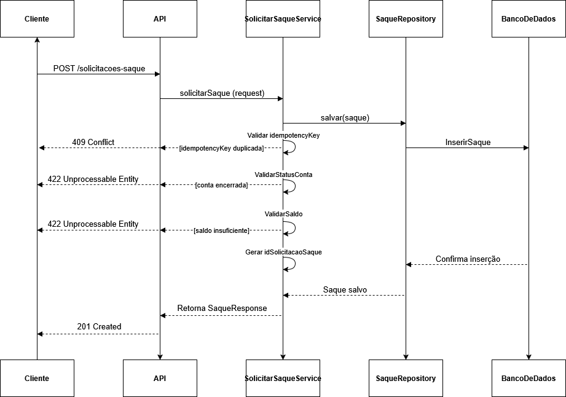

### Diagrama



Para explorar ou editar o diagrama de sequência, acesse o arquivo no Google Drive: [Clique aqui](https://drive.google.com/file/d/1XBUUFobv2gdpA8UJ8r-g5IlaMvI7oMf5/view?usp=drive_link)

---

### Configurando e Rodando com Docker

A aplicação pode ser executada facilmente usando o **Docker Compose**, que sobe tanto a aplicação quanto o banco de dados MongoDB.  

O `docker-compose.yml` já está configurado para:

- Subir o container da aplicação Java
- Subir o container do MongoDB
- Inicializar o banco de dados com dados de teste

**Passo a passo**

**1.** Clone o repositório

```console
git clone https://github.com/BiancaGolin/case-solicitacao-saque.git
```

```console
cd case-solicitacao-saque
```

**2.** Suba os containers

```console
docker compose up --build
```
---

### Dados de teste

Na pasta `mongo-init/` existe o arquivo `02-seed-data.js`, que contém inserts de alguns Clientes e Saques no banco.  
Esses dados permitem que você realize testes da aplicação sem precisar cadastrar manualmente os registros.

---

### Decisões Arquiteturais

Esta seção descreve algumas decisões arquiteturais tomadas durante o desenvolvimento da solução, bem como os trade-offs envolvidos.

O objetivo é evidenciar os critérios utilizados para garantir **consistência de dados, simplicidade de implementação e possibilidade de evolução da solução**.

---

### Escolha do MongoDB

O MongoDB foi utilizado como banco de dados principal da aplicação.

**Motivo**

A escolha foi baseada em alguns fatores:

- Simplicidade de modelagem para o domínio do problema
- Facilidade de integração com Spring Boot
- Suporte a documentos JSON
- Suporte a **transações em Replica Set**

A estrutura de documentos também permite armazenar registros de saques de forma simples e eficiente.


**Trade-offs**

Apesar das vantagens, o MongoDB apresenta algumas limitações quando comparado a bancos relacionais:

- Menor maturidade em cenários altamente transacionais
- Necessidade de configuração de **Replica Set para suporte a transações**

Neste projeto, essas limitações foram mitigadas através de:

- Controle de concorrência otimista
- Índices únicos

---

### Atomicidade da Operação de Saque

Atomicidade significa que uma operação deve ocorrer por completo ou não ocorrer. No fluxo de saque existem duas operações dependentes:

**1.** persistir o saque

**2.** atualizar o saldo da conta

Para garantir atomicidade foram utilizados:

- Transações MongoDB (Replica Set obrigatório)
```java
@Transactional
```

Isso garante que: ```registrar saque + atualizar saldo```

sejam tratados como uma única unidade lógica de trabalho.

Caso qualquer etapa falhe, todas as alterações são revertidas.

### Uso de Replica Set

O MongoDB foi configurado utilizando **Replica Set**, mesmo em ambiente local.

**Motivo**

Transações no MongoDB só são suportadas quando o banco está executando em modo **Replica Set**.

Como a operação de saque exige atomicidade entre:

- Registro do saque
- Atualização do saldo

**Trade-off**

A configuração de Replica Set adiciona uma pequena complexidade operacional ao ambiente de desenvolvimento, porém permite simular um comportamento mais próximo de um ambiente de produção.

---

### Concorrência

Foi adotado o padrão de **controle de concorrência otimista** utilizando o campo `version`.

**Motivo**

Operações financeiras estão sujeitas a **condições de corrida (race conditions)** quando múltiplas requisições tentam alterar o saldo da mesma conta simultaneamente.

O controle de versão permite detectar quando um documento foi modificado por outra operação antes da atualização atual ser aplicada.

**Trade-off**

O controle otimista não bloqueia recursos.

Isso significa que:

- Conflitos podem ocorrer
- A operação pode precisar ser repetida

Entretanto, essa abordagem é mais eficiente do que bloqueios pessimistas em cenários com **baixa probabilidade de conflito**, que é o caso esperado para este tipo de operação.

---

### Idempotência

Em sistemas distribuídos, requisições podem ser reenviadas pelo cliente devido a:

- timeout
- falhas de rede
- retries automáticos

A solução considera esse cenário e aplica mecanismos para evitar que uma mesma solicitação seja processada mais de uma vez.

O cliente deve enviar o header: `Idempotency-Key`


Esse valor identifica de forma única uma solicitação.

**Fluxo de idempotência**

**1.** Cliente envia requisição `POST /solicitacoes-saque` com o header `Idempotency-Key`

**2.** O service verifica no banco se já existe um registro com essa chave

   - Se já existir → retorna **409 Conflict**
   - Se não existir → continua o processamento

**3.** Executa as validações de negócio:

   - conta ativa
   - saldo suficiente
   - limite de saque diário
   - limite de saque por canal

**4.** Cria e salva o saque

**5.** Persiste o registro de idempotência

**6.** Retorna a resposta ao cliente

A entidade de idempotência possui um **índice único** no banco de dados.

Exemplo simplificado da entidade:

```java
@Indexed(unique = true)
private String idempotencyKey;
```
---

### Configuração do MongoDB

A aplicação possui um pacote `config` responsável por configurações específicas de infraestrutura.

**MongoConfig**

A classe `MongoConfig` centraliza as configurações relacionadas ao MongoDB.

Entre as responsabilidades dessa configuração estão:

- inicialização do **replica set** utilizado para suportar transações
- customização do comportamento do cliente Mongo
- preparação da aplicação para operações que exigem **consistência transacional**

O uso de replica set é necessário porque **transações no MongoDB só funcionam quando o banco está configurado como replica set**, mesmo em ambiente local.

No ambiente de desenvolvimento essa configuração é feita automaticamente via `docker-compose`.

**Suporte a OffsetDateTime**

A aplicação utiliza `OffsetDateTime` para representar timestamps.

Esse tipo de dado preserva:

- data  
- hora  
- offset de fuso horário  

Isso evita ambiguidades relacionadas a **timezone**, o que é importante em sistemas financeiros ou distribuídos.

No entanto, o **MongoDB não possui suporte nativo para `OffsetDateTime`**.

Por esse motivo, foram implementados **conversores customizados** na configuração do Mongo para realizar a transformação automática entre os tipos:

- `OffsetDateTime → Date`
- `Date → OffsetDateTime`

Dessa forma, a aplicação pode trabalhar internamente com `OffsetDateTime`, enquanto o MongoDB continua armazenando os dados no formato suportado (`Date`).

---

### Observabilidade e Métricas

A aplicação inclui **coleta de métricas** que permitem monitorar o comportamento do sistema de forma eficiente e detalhada.
Entre as métricas registradas, estão:
- **Quantidade de requisições**: total de chamadas feitas aos endpoints da aplicação.  
- **Identificação da requisição via `correlationId`**: permite rastrear cada requisição de forma única.  
- **Rastreamento de execução**: mede o tempo de execução e o fluxo de processamento de cada operação.  

**Endpoints de métricas**

Na collection do **Insomnia**, as requisições estão configuradas para acessar as métricas:

- Requisições aprovadas:  
  `http://localhost:8080/actuator/metrics/saque.aprovadas`  
- Requisições rejeitadas:  
  `http://localhost:8080/actuator/metrics/saque.rejeitadas`  
- Tempo de resposta:  
  `http://localhost:8080/actuator/metrics/saque.tempo.resposta`  

Essas URLs utilizam o **Spring Boot Actuator**, permitindo integração com dashboards de monitoramento, como Grafana ou Prometheus, se desejado.

---

### Simplicidade da Arquitetura

A solução foi construída utilizando uma arquitetura em camadas:

- Controller
- Service
- Repository
- Database (MongoDB)

**Motivo**

Para um sistema com escopo limitado, essa abordagem oferece:

- Clareza de responsabilidades
- Facilidade de manutenção
- Baixo overhead arquitetural

**Trade-off**

Em sistemas maiores, poderiam ser adotados padrões adicionais como:

- Arquitetura hexagonal
- Separação entre domain e application layer
- Event-driven architecture

No entanto, para o escopo deste projeto, a arquitetura em camadas oferece um equilíbrio adequado entre simplicidade e organização do código.

---

### Melhorias Futuras

Algumas evoluções possíveis para tornar o sistema mais robusto em um ambiente de produção:

- Dashboard de métricas

- Integrar as métricas coletadas com ferramentas de visualização como:

    - Grafana

    - Prometheus
